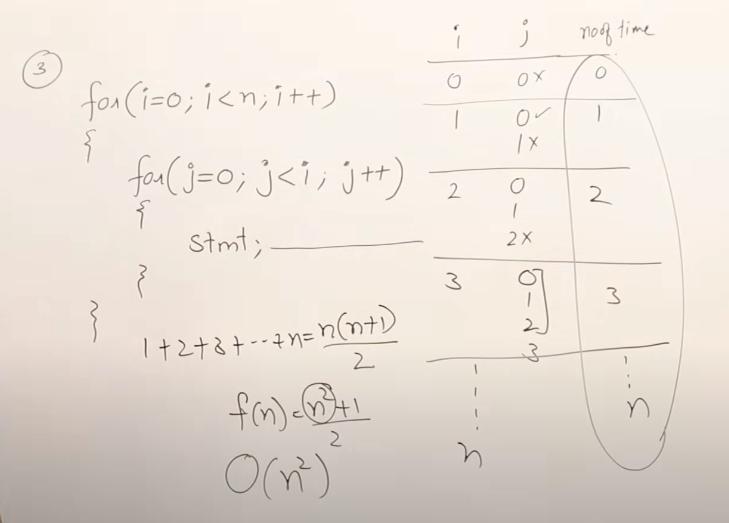

# Algorithms

## Algorithm vs Program
- Algorithms: 
	- Design
	- Domain knowledge
- Program:
	- Implementation.
	- ...

## Characteristic of Algorithms.

1. Input: One algorithm can take 0 or more inputs.
2. Output: Atleast 1 output.
3. Definiteness:  If human cannot solve the program $\implies$ should not ask computer solve it.
5. Finiteness: Should return at some point. Must have final statement.
6. Effectiveness: Should not *unnecessary statements*.

## How to write an Algorithm.

### Criteria for algorithm.
1. Time.
2. Space.
3. Network consumption
4. Power consumption.
5. CPU register.

```
swap (a,b) {
	temp = a;  -> 1
	a = b;     -> 1
	b = temp;  -> 1
}
		f(n)   -> 3 (constant)
```

## Frequency count method.

### 1. Example 1: Single loop
```
A = [8, 3, 9];

sum(A, n) { 					times
	s = 0; 						(1)
	for (i = 0; i < n; i++) {	(n + 1)
		  (1)    (n)    n
		s = s + A[i]; 			(n)
	}

	return s; 					(1)
} 	total: f(n) = 2n + 3 	=> O(n)
```

### 2. Example 2: Nested loops
```
											times
add(A, B, n) { 								(n + 1)
	for (i = 0; i < n; i++) {
		for (j = 0; j < n; j++) { 			(n) x (n + 1)
			c[i, j] = A[i, j] + B[i, j];	(n) x (n)
		}	
	}	
}				f(n) = 2n^2 + 2n + 1	 => O(n^2)
```

## Time complexity.
- Refer: 
	- https://www.reddit.com/r/computerscience/comments/s7h2vc/can_someone_explain_to_me_big_o_notation_like_im/
	- https://www.daniweb.com/programming/computer-science/threads/13488/time-complexity-of-algorithm


- Time complexity of an algorithm quantifies the amount of time taken by algorithm.



### Other example: P <= n
```
for (i = 1; P <= n; i++) {
	P = P + i;
}
```

For this we don't know what is $n$ value but we know loop stop at $P > n$

|  i  |          P          |
| :-: | :-----------------: |
|  1  |        0 + 1        |
|  2  |        1 + 2        |
|  3  |      1 + 2 + 3      |
|  k  | 1 + 2 + $\dots$ + k |
Assume P > n:
- $P = \frac{k(k+1)}{2}$
- $\frac{k(k + 1)}{2} > n \implies \text{the loop will stop}$
- $k^2 > n$
- $k > \sqrt{n}$
$\implies$ TC: $O(\sqrt{n})$

### One more: i = i * 2

```
for (i = 1; i < n; i = i * 2) {
	// stmt	
}
```

|       i       |
| :-----------: |
|       1       |
|   1 x 2 = 2   |
|  2 x 2 = 2^2  |
| 2^2 x 2 = 2^2 |
|      2^k      |

Assume $i \ge n$
- $i = 2^k$
- $2^k \ge n$
- $2^k = n$
- $k = \log_{2}{n}$
$\implies O(\log_{2}{n})$


### Summary

```
for(i = 1; i < n; i = i * 2) {
	// stmt	
}
```
$i = 1 \times 2 \times 2 \times  \dots \times n$ 
$2^k = n \implies k = \log_{2}{n}$

- Sometime should take cell value of $\lceil log_{2}{n}\rceil$


```
for(i = 1; i <= n; i++) {
	//stmt;
}
```

$i = 1 + 1 + \dots + 1 = n$ 
$\implies k = n$


